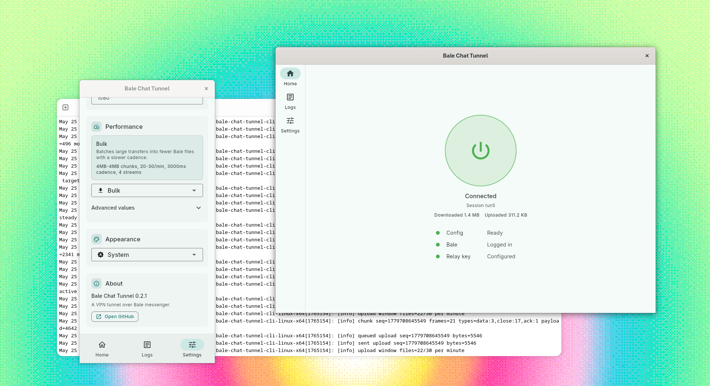

<p align="center">
  
</p>

<h1 align="center">Bale Chat Tunnel</h1>

<p align="center">
  A tunnel that moves traffic through Bale Messenger by uploading and downloading encrypted files.
</p>

<p align="center">
  
</p>

Bale Chat Tunnel uses Bale Saved Messages as the transport layer. The client
packs traffic into encrypted tunnel files, uploads them to Bale, and the relay
downloads, decrypts, and forwards them. Responses travel back the same way:
encrypted files are uploaded by the relay and downloaded by the client.

## Contents

- [Quick Start](#quick-start)
- [Architecture & Configuration](#architecture-configuration)
- [Development](#development)
- [Testing](#testing)
- [Troubleshooting](#troubleshooting)
- [Contributing](#contributing)
- [License](#license)

## Quick Start

You need:

- A client machine where your browser, OS, or app will connect.
- A Linux x64 relay machine that will make the outside network connections.
- A Bale account. You may use the same account on both machines, or use
  separate accounts.

### 1. Set up the client

On the client machine:

- Open the desktop app.
- Go to Settings.
- If this is the first run, click `Initialize config`.
- Add a Bale account.
- Copy `Client public key`.

### 2. Set up the relay

On the relay machine, run:

```bash
bash <(curl -fsSL https://raw.githubusercontent.com/evokelektrique/BaleChatTunnel/master/scripts/install-relay.sh)
```

Answer the installer prompts:

- Use the same session ID as the client.
- Paste `Client public key` when it asks for `Client public key`.
- Add a Bale account when setup asks.
- Copy the printed `relay_public_key`.

### 3. Finish the client

Back on the client machine:

- Paste `relay_public_key` into `Relay public key` in Settings.
- Go to Home and start the tunnel.
- Configure your browser, OS, or app to use:

```text
SOCKS5 127.0.0.1:1080
```

<details>
<summary>Advanced usage</summary>

Set up and run a client from the CLI:

```bash
./bale-chat-tunnel-cli-linux-x64 setup --profile .btun-client
./bale-chat-tunnel-cli-linux-x64 client --profile .btun-client --socks-port 1080
```

Common CLI commands:

```text
./bale-chat-tunnel-cli-linux-x64 setup
./bale-chat-tunnel-cli-linux-x64 status
./bale-chat-tunnel-cli-linux-x64 relay
./bale-chat-tunnel-cli-linux-x64 client --socks-port 1080
```

Relay commands:

```bash
bale-chat-tunnel-cli-linux-x64 account list --profile ~/.btun-relay
bale-chat-tunnel-cli-linux-x64 account add --profile ~/.btun-relay
journalctl --user -u btun-relay -f
```

Installer options:

```bash
BTUN_VERSION=v0.2.8 bash <(curl -fsSL https://raw.githubusercontent.com/evokelektrique/BaleChatTunnel/master/scripts/install-relay.sh)
BTUN_INSTALL_DIR=/usr/local/bin BTUN_PROFILE=/etc/btun/relay bash <(curl -fsSL https://raw.githubusercontent.com/evokelektrique/BaleChatTunnel/master/scripts/install-relay.sh)
BTUN_RUN_SETUP=0 bash <(curl -fsSL https://raw.githubusercontent.com/evokelektrique/BaleChatTunnel/master/scripts/install-relay.sh)
BTUN_INSTALL_SERVICE=0 bash <(curl -fsSL https://raw.githubusercontent.com/evokelektrique/BaleChatTunnel/master/scripts/install-relay.sh)
BTUN_ENABLE_SERVICE=0 bash <(curl -fsSL https://raw.githubusercontent.com/evokelektrique/BaleChatTunnel/master/scripts/install-relay.sh)
```

Uninstall relay service, binary, and default relay profile:

```bash
bash <(curl -fsSL https://raw.githubusercontent.com/evokelektrique/BaleChatTunnel/master/scripts/uninstall-relay.sh)
```

Set `BTUN_REMOVE_PROFILE=0` to keep `~/.btun-relay`.

</details>

## Architecture & Configuration

> This is intentionally slow. It is meant as an emergency access path for
> situations where normal internet access is difficult, censored, or blocked,
> not as a replacement for a regular VPN or proxy.

Architecture:

- The client accepts local application traffic and maps each connection to a
  tunnel stream.
- Stream events become tunnel frames: `open`, `data`, `ack`, `close`, `reset`,
  and related control messages.
- Frames are batched into binary chunk files with a session ID, direction,
  sequence number, stream ID, ACK number, and payload bytes.
- Bale Saved Messages is the transport layer. The client uploads encrypted
  client-to-relay chunk files; the relay downloads them, forwards the traffic,
  and uploads encrypted relay-to-client response files.
- Chunk filenames include the tunnel session, direction, and sequence number so
  each side can filter only the files meant for that tunnel.
- Received chunks are tracked in local state to avoid duplicate processing.
  Non-ACK chunks stay in a retry cache until the other side acknowledges them.
- Multiple Bale accounts can be enabled. Uploads are load-balanced, and accounts
  that hit rate limits or transient HTTP errors are skipped until their backoff
  period ends.

Security and transport:

- X25519 key pairs are generated locally and exchanged between client and relay.
- HKDF-SHA256 derives separate per-session send and receive keys from the shared
  secret, session ID, and traffic direction.
- AES-GCM with 256-bit keys encrypts and authenticates every chunk file.
- Chunk metadata is authenticated as AES-GCM associated data, including session,
  direction, sequence number, and compression flag.
- LZ4 frame compression runs before encryption and is used only when it makes the
  chunk smaller.
- Wrong-session, wrong-direction, corrupted, or undecryptable tunnel files are
  ignored instead of being forwarded.

Profiles store tunnel config, Bale session state, and local runtime state. The
default CLI profile is `.btun`; this README uses `.btun-client` and
`.btun-relay` to keep roles separate.

Tunnel flow:

```text
Browser/App
    |
    v
SOCKS5 127.0.0.1:1080
    |
    v
client
    |
    v
Bale Messenger (Saved Messages)
    |
    v
relay
    |
    v
Internet
```

Important defaults:

| Setting        | Default          |
| -------------- | ---------------- |
| SOCKS endpoint | `127.0.0.1:1080` |
| Transport mode | `bulk`           |

Transport modes:

- `bulk`: Default mode. Uses larger chunks and slower flushes for downloads or sustained transfers.
- `balanced`: General-purpose mode for browsing and mixed traffic.
- `low-latency`: Flushes small writes sooner for interactive traffic.

All modes trade speed for resilience through Bale file uploads and polling.

Use matching session IDs on both profiles, and make sure each profile has the
other side's public key.

## Development

Requirements:

- Flutter/Dart compatible with SDK `^3.11.0`.
- For Linux desktop builds: `clang`, `cmake`, `ninja-build`, `pkg-config`,
  `libgtk-3-dev`, and `liblzma-dev`.

Build from source:

```bash
git clone https://github.com/evokelektrique/BaleChatTunnel.git
cd BaleChatTunnel
make pub-get
make build-cli-linux-x64
```

Run the Flutter app:

```bash
flutter run -d linux
```

Build targets:

```bash
make build-linux-x64
make build-windows-x64
make build-android-apk
make build-cli-linux-x64
make build-cli-windows-x64
```

Main code locations:

- `lib/main.dart`: Flutter app.
- `bin/`: CLI entry point.
- `lib/src/btun/`: tunnel runtime, protocol, SOCKS5 server, relay, config, and transport.
- `packages/bale_client/`: Bale authentication, messaging, and file APIs.
- `scripts/install-relay.sh`: Linux x64 relay installer.
- `scripts/uninstall-relay.sh`: Linux x64 relay uninstaller.

## Testing

```bash
make analyze
make test
```

`make test` runs the root Flutter tests and `packages/bale_client` tests.

## Troubleshooting

- Confirm both machines can reach Bale.
- Confirm both profiles use the same session ID.
- Confirm both profiles have the other side's public key.
- Confirm your app is using `SOCKS5 127.0.0.1:1080`.
- Check relay logs with `journalctl --user -u btun-relay -f` when using the installer service.

## Contributing

Use [GitHub Issues](https://github.com/evokelektrique/BaleChatTunnel/issues) for bugs, build problems, feature requests, and UI feedback.

## License

[MIT License](./LICENSE).
